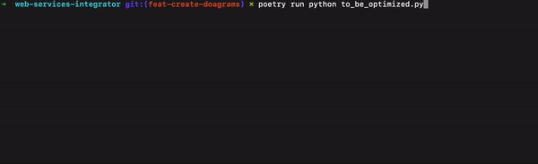

### 1. `code_optimization.md`

#### Code Optimization Challenge

The primary objective of this challenge is to enhance the performance of the given code block, ensuring it runs in the minimum time possible. The code, as it stands, demonstrates interaction between a `Client` and a `Server` class, with deliberate time delays.

- A `Client` class, which has a request method that simulates a delay.
- A `Server` class that has the functionality to listen and process the client request, alongside its own time delay.

The task:

- Analyze the current implementation.
- Optimize the code for better efficiency, without altering the value of `TIME_DELAY`.


#### The result:



 - original code:[to_be_optimized.py](../to_be_optimized.py)
 - optimized code: [concurrent_observer_pattern.py](../concurrent_observer_pattern.py)

As observed from the gif and the provided terminal output, the initial code took approximately `6.0066` seconds to run:

With the implementation described bellow, the newest versio get approximately `3.0053` - practically the `TIME_DELAY = 3`

#### Decisions and Optimization:

To reduce the execution time, we made the following decisions:

1. **Introduce Concurrency:** We implemented threading to allow the server and the client to operate concurrently. By doing so, the server and client no longer need to wait for each other to complete their respective tasks, leading to a considerable reduction in the total execution time.

2. **Observer Pattern:** We incorporated the Observer pattern where the server acts as the subject, notifying its observers (the client, in this case) of any changes. This results in a decoupled architecture that's scalable and maintainable.

    - UML class diagram
    
    font: https://en.wikipedia.org/wiki/Observer_pattern
##### Optimized Code Execution:

After the optimizations, the code's runtime was reduced to approximately `3.0054` seconds:

```
$ poetry run python concurrent_observer_pattern.py

Starting server...
Listening event...
Received event: New data available
The work is done!!!
Processing event
Client request processed.
Time spent: 3.0053622722625732
```

## Conclusion:

By introducing the Observer pattern combined with threading, we successfully reduced the code's execution time by almost half, achieving the optimization goal.

## Disclaimer:
For the third task of the project, we adopted a library strategy based on the logic utilized in this optimization task. The skeleton of this library can be found in this repository at the folder: `concurrent_notifier`. It's crucial to note that while this library uses the same classes and logic from the optimized script, it is not fully implemented. The primary purpose of this project is not the complete implementation of the library but rather its mention in the architecture task.
